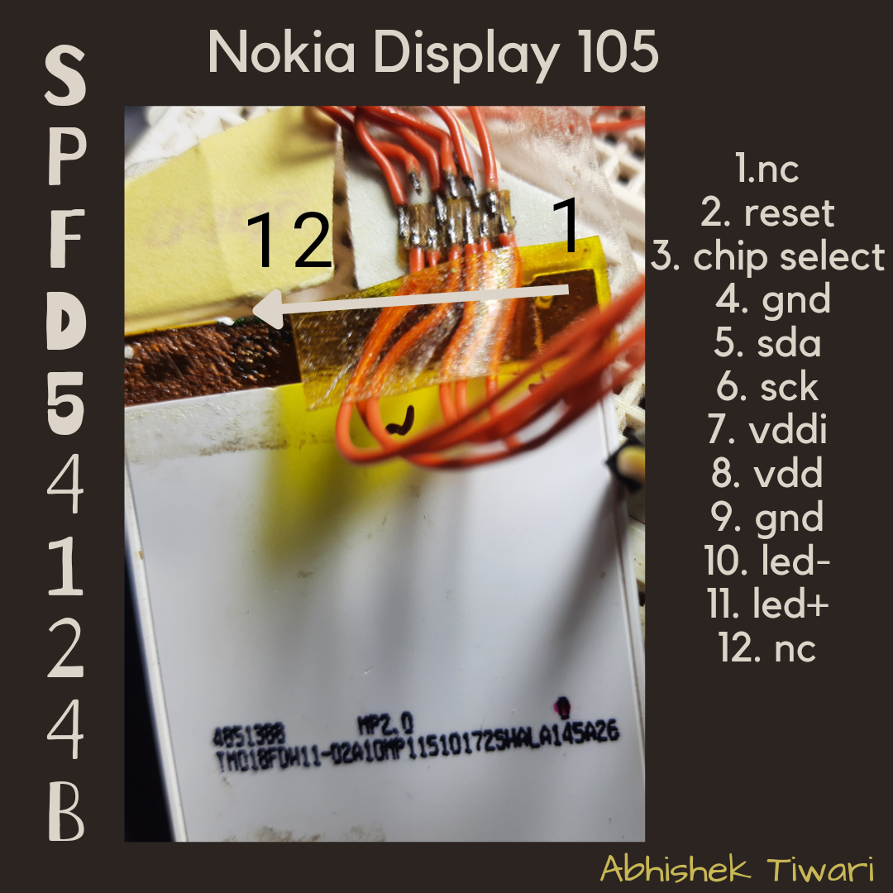

# **LCD_Nokia_105_Drivers**
this given lcd i found from a old nokia 105 mobile phone. indeed, i enjoyed the journey and proccess to make it work like this.

9 bit spi data transmission is not easy by using hardware spi. because generally spi are in 8 bit,18 bit and 32 bit. but i need 9 bit spi clock. which why currently stick on bit bang register manipulation to simulate as api transmission.

i was thinking to make a youtube video on this display. just to share my experience.
i don,t know but i really want this lcd with pcb to play around in electronics projects. 
## **SPFD54124B** Driver IC

# **Current Support: Arduino Uno, ESP8266 And ESP32 WROOM32**
## Goals
-  [ ] hardware spi
-  [ ] sd card support
## Accompolised
-  [x] Adafruit_gfx library: Spritegraphics,graphs,circle, rectangle,and triangle
-  [x] size of a character in option
-  [x] fast image processing
-  [x] more information of every     function in detailed
-  [x] debug function
-  [x] **esp32** and Arduino UNO(Atmega328p)
-  [x] PCB design with - ESP12S,ESP32,and Breadboard Breakout
-  [x] compatibility : esp8266

## Current Status
-  [ ] compatibility stm32